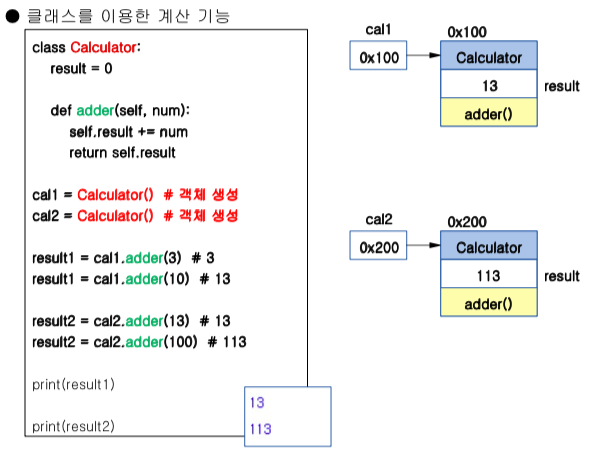
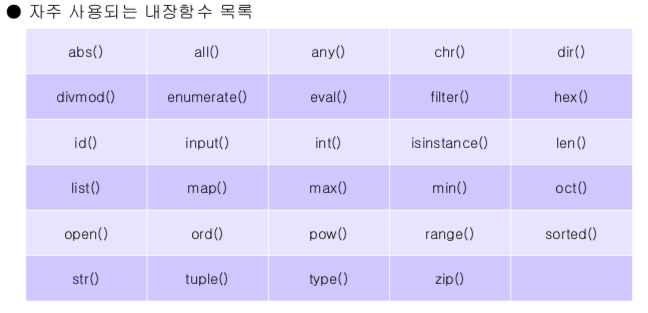
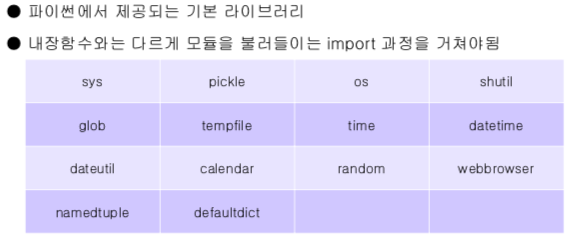

## 01. 자료형_변수

>  mutable: list, dictionary, set	/	immutable: number, string, tuple

```python
# String (Formatting)

'Python version %d' %3
'Python version %0.2f' %3.6
'%s version' %('Python', 3)

'{lang} is easy, version {0}.{1}'.format(3, 6, lang = 'Python')
```

```python
# String (Functions)

sent = "Life is too short, You need Python"

sent.count(' ', 5, 12) 	#없으면 0 출력
sent.find(' ', 8, 12) 	#없으면 -1 출력
sent.index(' ', 8, 12)	#없으면 error 발생
sent.upper() / sent.lower()
sent.strip()
sent.replace('Python', 'Java')
sent.split(' ') 				#list로 출력
'/'.join('abcd')
```

```python
# List (Functions)

test = []

test.append('a')					#마지막 요소로 추가
test.insert(2, 'a')				#지정된 위치에 삽입
test.extend(['a', 'b']) 	#리스트 형식으로 추가해도 각각의 요소로 들어감
test.remove('a')
test.pop('a')							#마지막에 위치한 'a' 추출 후 제거
test.sort(reverse = True) #내림차순
test.reverse()						#현재 순서에서 반대로
test.index('a')
test.count('a')
```

~~~python
# Tuple (수정 및 삭제 불가능 / index 사용 가능)
~~~

```python
# Dictionary

dict_text = {(1, 2, 3) : 'tuple'} 	#수정 불가능한 요소만 key 가능
dict_list = list(dict_text.items())
del dict_list[(1, 2, 3)]
'name' in dict											#name이라는 key로 존재하는지
```

```python
# Set (중복 불가능, 순서 없음)

set('python')		#한 글자를 요소로 하는 리스트 생성
```


## 02. 제어문

```python
# If (조건부 표현식)

print('pass') if score >= 80 else print('fail')
```

```python
# While

num = 0
while num < 10:
  num += 1
  if num%2 == 0:
    continue			#num이 짝수일 때에는 넘기라는 의미
    
  print(num)
```

```python
# For (reversed)

for i in reverse(range(11)): #10부터 0까지
  print(i)
```

```python
# For (list comprehension)

result = [i*3 for i in range(10) if i%2 != 0]
```

```python
a = [1, 2, 3, 4]
result = []

for n in a:
    result.append(n*3)		#두 개가
    result += [n*3] 			#동일한 코드
print(result)
```

```python
list_a = [10, 20, 30, 40, 50, 60, 70]

for i in reversed(range(len(list_a))):
    if list_a[i] % 3 == 0:
        list_a.pop(i)		#pop은 뽑아서 추출하기 때문에 reversed로
        
print(list_a)
```


## 03. 함수

```python
# 매개변수의 갯수를 정해두지 않으려면 *args (튜플 형태로 반환)

def total(*args):
    total = 0
    for i in args:
        total += i
    return total

num = total(1, 2, 3, 4)
num1 = total(1, 2, 3)

print(num, num1)
```

```python
# keyword를 지정하는 arguments **kwargs (딕셔너리 형태로 반환)

def func(*args, **kwargs):
    return args, kwargs

num2 = func('a', 'b', a=1, b=2)
print(num2)
```

```python
# 일회성 함수

lambda_list = [lambda a, b: a+b, lambda a, b: a-b]
print(lambda_list[0](5, 2), lambda_list[1](5, 2))
```

```python
# global의 역할

result = 0

def add(num):
    global result
    result += num
    return result

print(add(3))	# 3
print(add(4)) # 7
```


## 04. 입력_출력

```python
a = 'score'
b = 100

print(a + str(b))		#score100
print(a, b)					#score 100
```

```python
import pickle

file = open('test.bin', 'wb')
list1 = ['1', 2, 3]
pickle.dump(list1, file)
file.close()

result = pickle.load(file)
print(result)
```

```python
file = open('test.txt', 'rt')

#file.read()
file.read()

#file.readline()
while True:
  result = file.readline()		
  if not result:
    break
   else:
    print(result)

#file.readlines()    
result = file.readlines()
for i in result:
  print(i)
```


## 05. 클래스



```python
# 모듈 (= 라이브러리)

import Calculator
Calculator.minus(5, 3)

from Calculator as cal
cal.minus(5, 3)

from Calculator import minus
minus(5, 3)

from Calculator import *
minus(5, 3)
plus(5, 3)
```

```python
# 모듈 만들어서 사용하기 (같은 위치에 클래스/함수 만들고 .py 확장자로 저장)

import test
test.plus(5, 3)
```


# 06. 예외처리

```python
# else (예외가 발생하지 않았다면 try에 이어 else까지 실행)

try:
    file = open('python.txt', 'r')
except:
    print('예외발생')
else:
    file.read() 
    print(file) 
    file.close()
```

```python
# finally (예외 발생 여부와 상관 없이 항상 실행되는 finally)

try:
    file = open('test.txt', 'r') 
    print('file open')
    text = file.read() print(text)
    text += 1
except TypeError as e:
    print(e, '예외발생')
finally:
    file.close()
```


# 07. 내장함수

```python
# 모든 내장함수
print(dir(__builtins__))
```

```python
# 상황에 맞는 내장함수 찾기

s = set()
print(dir(s))		# set에 사용할 수 있는 내장함수 print
s.add(1)
```

```python
# filter w.lambda

num_list = [1, -2, 3, -5, 8, -3]
print(list(filter(lambda n : n>= 0, num_list)))
```




# 08. 외장함수




# 09. 정규 표현식

> ^ (부정. 대괄호 안)			[ ^0-9] # 0 부터 9까지 모든 숫자를 제외한 문자
>
> . (모든 문자) 					(a.b / abbbbb) [.]는 마침표를 의미
>
> *(바로 앞 문자 0개 이상) 	(a * b / aaaaaaab 또는 b)
>
> +(바로 앞문자 1개 이상)	 (a * b / aaaaaaab)
>
> {2, 4} (2~4개만큼만 나와야 함)	(c{1, 3}z / cz 또는 ccz 또는cccz)
>
> ^ (시작. 대괄호 밖)
>
> $ (종료. 대괄호 밖)
>
> () (그룹화. indexing 가능)		(\d{3})-(\d{4})-(\d{4})


# 10. 크롤링

> 크롤링을 하기 위해 필요한 라이브러리
>
> - 데이터 통신: **requests** / urllib / urllib2
>
> - 파싱: **bs4** (BeautifulSoup)
> - **Selenium** = requests + bs4


